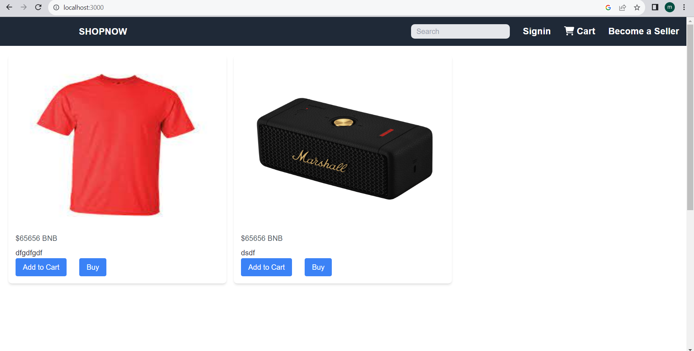
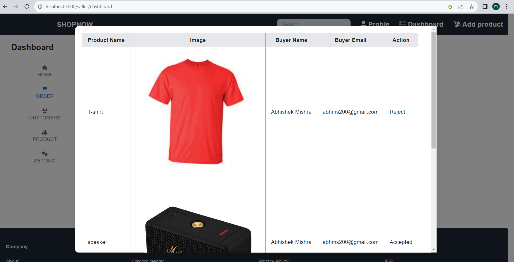
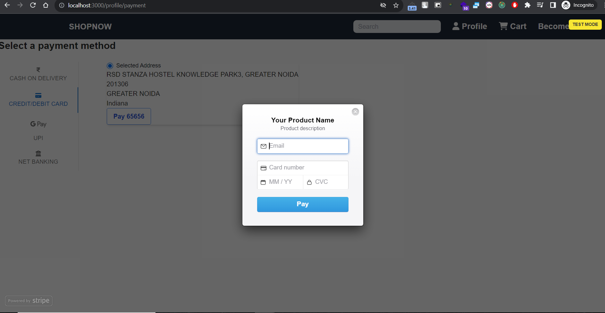

# Next.js E-com Project

This is a Next.js project build with TypeScript,and this is E-COM website for selling and buying items with stripe and other payment method integrated.

## Getting Started


### Installation

1. Clone the repository to your local machine:

   ```bash
   https://github.com/abhms/e-com.git

## Getting Started

First, run the development server:

```bash
npm install
npm run dev
```
## Screenshots



